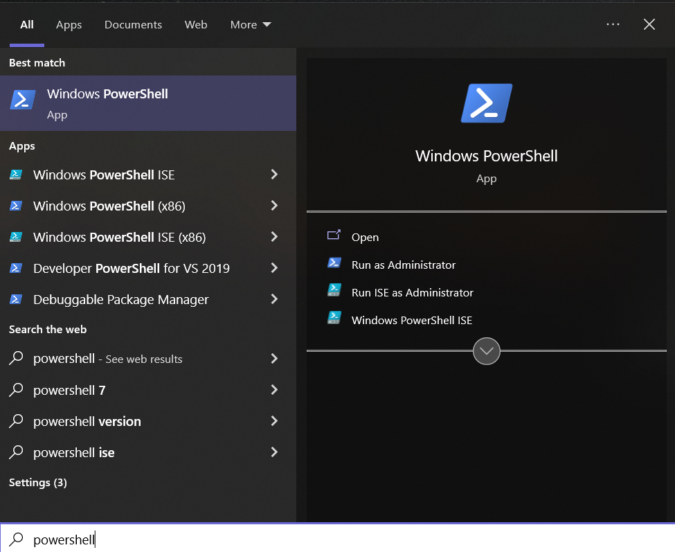

## CurseForge App (Windows / Mac)
1. Download the [CurseForge App](https://curseforge.overwolf.com/) and [Git](https://git-scm.com/downloads) if you haven't already.

2. Download the curseforge file from the [Relases Page](https://github.com/RobertasJ/skylore/releases/tag/1.6) and upzip it into `C:\Users\{UserName}\Documents\Curseforge\Minecraft\Instances`. * Note: If you've previously used the Twitch App the path will most likely be `C:\Users\{UserName}\Documents\Twitch\Minecraft\Instances`.

4. open powershell as admin

5. run **Set-ExecutionPolicy -ExecutionPolicy Bypass** command

6. type **A** and press ENTER

3. run sync.ps1 to sync to download the newest version of the modpack. note: it is recommended to run the script often to always stay up to date.
4. Open the CurseForge App and you should see the modpack. If you already had CurseForge App open, restart it.

if you need help, please ask in the official discord: https://discord.gg/6rkdm48
